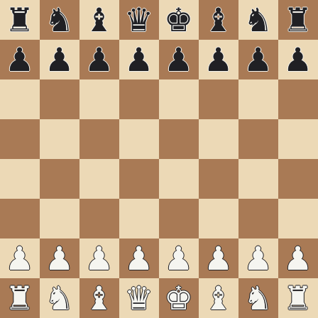
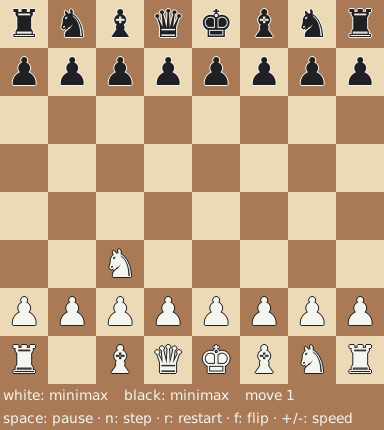

# Demos

Animated games rendered straight from the engine. Regenerate with `just demos`.

## minimax vs random

White (alpha-beta minimax, depth 4) against a random mover — White converts the
material edge into checkmate.

## minimax vs minimax

Both sides search; with no tactical breakthrough the game ends in a draw by
threefold repetition — exercising the draw-detection path.

